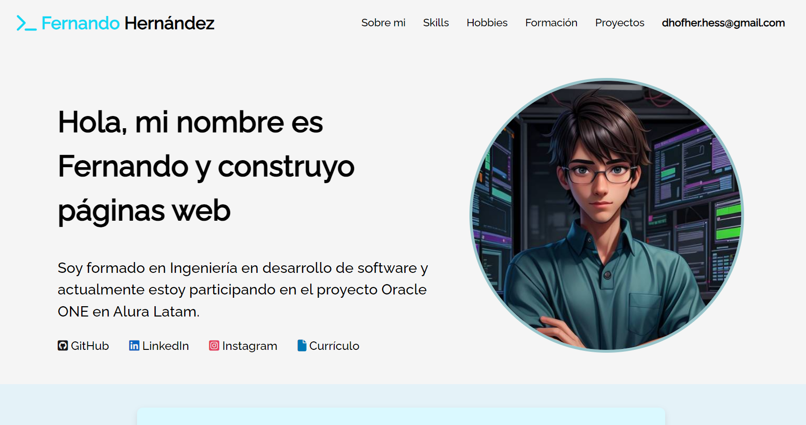
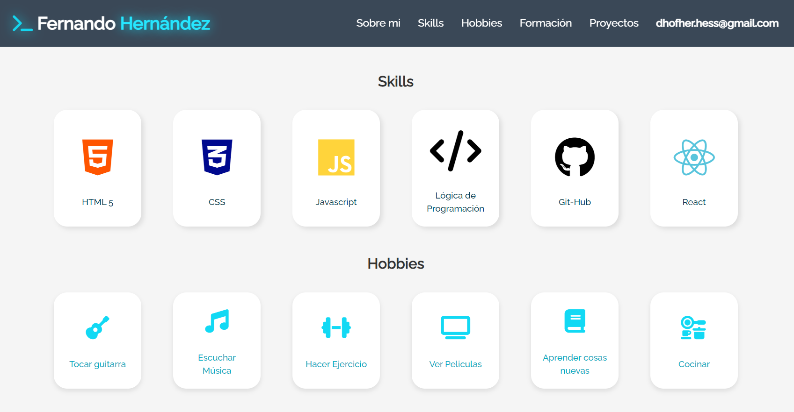

# Challenge ONE | Front End - Portafolio | Fernando Hernández

     

### ¡Bienvenido a mi portafolio personal!

---

Este repositorio contiene el código fuente de mi portafolio personal donde presento mis habilidades, proyectos y experiencia.

## Tecnologías Utilizadas

- **HTML5**: Estructura del contenido.
- **CSS3**: Estilos y diseño.
- **JavaScript**: Funcionalidades interactivas.
<!-- - **[Otras tecnologías]** -->

## Secciones del Portafolio

- **Sobre mí**: Breve introducción y biografía.
- **Skills**: Habilidades técnicas.
- **Hobbies**: Intereses y pasatiempos.
- **Formación**: Educación y cursos.
- **Proyectos**: Trabajos y proyectos realizados.
- **Contacto**: Formulario para contacto directo.

## Contacto

Para cualquier consulta, puedes contactarme a través de [dhofher.hess@gmail.com](mailto:dhofher.hess@gmail.com).

<!-- ## Capturas de Pantalla -->

     

---

¡Gracias por visitar mi portafolio!

<!-- en el archivo de oracle one esta el RM.md original -->